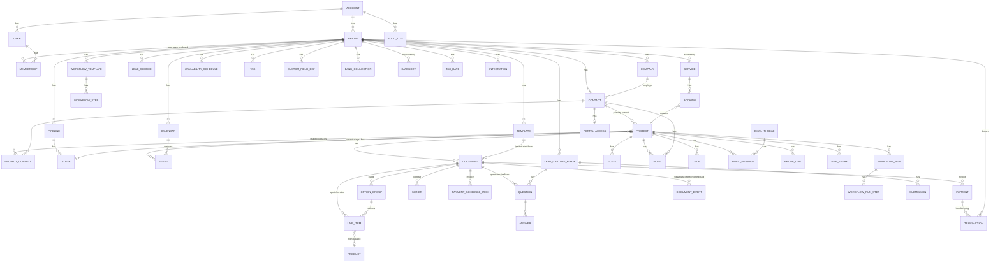

# Data model

Derived from how 17hats structures data (Contact → Project → everything) with
the additions needed for the improvements (Company, Pipeline, Workflow
branching, audit trail). Relational (PostgreSQL). All tables carry
`id (uuid)`, `account_id`, `brand_id` where brand-scoped, `created_at`,
`updated_at`, `deleted_at` (soft delete).

## Entity diagram

## Core tables (key columns only)

### account, brand, user, membership
- `brand`: name, subdomain (unique), custom_domain, logo, colors (json), fonts, timezone, locale, currency, address, weather_zip, sender_identity, portal_settings (json), invoice_settings (json), reminder_settings (json).
- `membership`: user_id, brand_id, role (owner|admin|member), permissions (jsonb per module: contacts, projects, calendar, documents, invoices, bookkeeping, settings...).

### company, contact
- `company`: name, website, address, phone, notes, tags[], custom (jsonb).
- `contact`: company_id?, first_name, last_name, display_as_company (bool), emails[] (primary flag), phones[] (type), addresses[], website, birthday, socials (jsonb), profile_image, referred_by, type (lead|client|cold_prospect|other), lead_source_id?, tags[], custom (jsonb), portal_pin_hash?, notes_summary. Index on lower(email) per brand for matching.
- `contact_type_history`: contact_id, from, to, reason (quote_accepted|contract_signed|payment|manual), at.

### project, project_contact, pipeline, stage
- `project`: contact_id, name, status (lead|active|completed|archived), date (main event id), calendar_id, lead_source_id?, pipeline_id?, stage_id?, stage_entered_at, tags[], custom (jsonb), new_lead (bool, cleared on first action).
- `project_contact`: project_id, contact_id, role (spouse|planner|vendor|other), can_sign (bool), can_view_portal (bool).
- `pipeline`: name, kind (lead|client|custom), position. `stage`: pipeline_id, name, position, entry_rule (jsonb: by_tag | by_days | manual | by_event), automations (jsonb), color.

### calendar, event
- `calendar`: name, color, kind (internal|google|microsoft|ical_feed), external_id, sync_token, visibility.
- `event`: calendar_id, project_id?, booking_id?, title, start_at, end_at, all_day, location (jsonb), description, external_id, is_main_event.

### template, document
- `template`: type (email|quote|contract|invoice|questionnaire|proposal), email_type?, name, subject?, body (rich json), settings (jsonb: valid_until_days, tax_rate_id, discount, attach_contract_template_id, attach_invoice_template_id, tipping, partial_payments, signature_mode...), version.
- `document`: project_id, template_id?, type, status (draft|sent|viewed|accepted|declined|signed|partial|paid|overdue|completed|void|expired), number (per brand sequence), display_title, internal_title, body (rich json), settings (jsonb), totals (jsonb: subtotal, discount, tax, tip, total, paid, balance), valid_until, due_at, sent_at, completed_at, parent_document_id? (3-in-1 chain: quote → contract → invoice), public_token (unguessable), pdf_file_id?, version.
- `line_item`: document_id, option_group_id?, product_id?, name, description, unit_price, quantity, client_qty_min?, client_qty_max?, selected_by_default, selected (client choice), taxable, tax_rate_id?, category_id?, photo_file_id?, position.
- `option_group`: document_id, kind (choose_one|choose_any), title, position.
- `payment_schedule_item`: document_id, amount, percent?, due_at, position, status, reminder_sent_at, autocharge.
- `payment`: document_id, amount, tip, method (card|ach|cash|check|other|square|paypal), processor, processor_ref, status (pending|succeeded|failed|refunded), received_at, note, fee_amount, refund_of_payment_id?.
- `signer`: document_id, contact_id? | user_id?, order, role (client|related|countersign), status, signed_at, ip, user_agent, signature_image_file_id, fields (jsonb).
- `document_event`: document_id, kind (sent|viewed|accepted|declined|signed|payment|submitted|reminder_sent|voided), actor (contact|user|system), at, meta (jsonb).

### question, answer, submission
- `question`: owner_type (document|lead_capture_form), owner_id, type (short|long|yes_no|list|checkboxes|date|number|email|phone|address|file|signature|heading|text|lead_source), label, help, required, options (jsonb), maps_to (jsonb: entity, field or custom_field_def_id), parent_question_id?, show_when (jsonb branch rule), position.
- `answer`: question_id, submission_id? | document_id?, value (jsonb), file_id?.
- `submission`: lead_capture_form_id, contact_id, project_id, source_url, utm (jsonb), ip, at.

### lead_capture_form, lead_source
- `lead_capture_form`: name, description, project_name_template, settings (jsonb: notify_email, auto_response_template_id, thank_you | redirect_url, contact_tags[], project_tags[], workflow_template_id, lead_source_id, appearance), embed_key, active.
- `lead_source`: name, status (active|inactive|archived), kind (form|booking|manual|email_rule).
- `email_capture_rule`: sender_pattern, parser (theknot|weddingwire|showit|regex), mapping (jsonb).

### workflow
- `workflow_template`: name, version, base_date_rule (jsonb), steps (normalised in `workflow_step`).
- `workflow_step`: template_id, position, kind (todo|action|pause|condition|wait), action_type (send_email|send_quote|send_contract|send_invoice|send_questionnaire|start_workflow|archive|change_calendar|add_tag|remove_tag|move_stage|assign_user|notify|webhook), template_ref_id?, mode (auto|approval), timing (jsonb: relative_to previous|base_date|fixed, offset_days, before|after|on, time_of_day), completion_rule (sent|viewed|accepted|signed|first_payment|paid|submitted|all_complete|manual), condition (jsonb for kind=condition: field, op, value, then_step_id, else_step_id), tags_add[], tags_remove[], assignee_user_id?.
- `workflow_run`: project_id, template_id, template_version, status (running|paused|completed|cancelled), base_date, started_at, started_by (form|booking|tag|manual|workflow|api).
- `workflow_run_step`: run_id, step_id, status (pending|scheduled|awaiting_approval|done|skipped|failed), due_at, done_at, output_document_id?, todo_id?, log (jsonb).

### todo, note, file, email, phone_log, time_entry
- `todo`: project_id?, title, due_at, assignee_user_id?, repeat (rrule), snoozed_until, done_at, source (manual|workflow), run_step_id?.
- `note`: owner_type (contact|project|company), owner_id, body, author_user_id, pinned.
- `file`: owner_type, owner_id, storage_key, name, mime, size, shared_with_client (bool), uploaded_by (user|contact).
- `email_thread`: project_id?, contact_id?, subject, external_thread_id. `email_message`: thread_id, direction, from, to[], cc[], bcc[], subject, body_html, body_text, sent_at, scheduled_for, status (draft|scheduled|sent|failed|received), opens (jsonb), attachments (file ids), template_id?, external_message_id.
- `phone_log`: project_id, direction, at, duration, summary.
- `time_entry`: project_id, user_id, rate_id, started_at, ended_at, minutes, billable, invoiced_line_item_id?.

### scheduling
- `service`: name, kind (individual|group), capacity?, duration_min, description, image, location (jsonb type + details), calendar_id, questions (via question), approval_mode (instant|pending), payment (jsonb: none|deposit amount|full, product_id), emails (confirmation, reminders[], cancellation template ids), cancel_policy (jsonb), workflow_on_pending_id?, workflow_on_confirmed_id?, project_mode (new|attach), availability_schedule_id, buffer_before, buffer_after, public_slug.
- `availability_schedule`: name, timezone, weekly_hours (jsonb), overrides (jsonb), min_notice_hours, max_horizon_days, max_per_day, max_per_week, calendar_check_ids[], team_user_ids[].
- `booking`: service_id, contact_id, project_id, event_id, status (pending|confirmed|cancelled|rescheduled|no_show), start_at, end_at, answers, payment_id?, zoom_join_url?, rescheduled_from_id?.

### bookkeeping
- `transaction`: kind (income|expense|transfer), amount (signed), at, category_id?, vendor, description, bank_connection_id?, external_id, payment_id?, invoice_document_id?, verified (bool), receipt_file_id?, tax_amount, fee (bool).
- `category`: name, kind (income|expense), parent_id?, default.
- `bank_connection`: provider (plaid), item_id, institution, accounts (jsonb), last_synced_at, status.
- `tax_rate`: name, rate, region, default.
- `product`: internal_name, display_name, description, price, category_id, taxable, tax_rate_id, photo, client_qty (jsonb), default_selected, workflow_on_first_payment_id?, workflow_on_paid_id?, variants (jsonb).

### portal, integration, audit
- `portal_access`: contact_id, enabled, pin_hash?, welcome_override, section_overrides (jsonb), last_login_at, magic_token.
- `integration`: brand_id, provider (stripe|square|paypal|google|microsoft|zoom|plaid|qbo|xero|zapier), credentials (encrypted), settings, status, last_sync_at.
- `audit_log`: actor (user|contact|system), action, entity_type, entity_id, before (jsonb), after (jsonb), ip, at.
- `webhook_endpoint`, `webhook_delivery`, `api_key`.

## Token resolution

Tokens resolve against a context object built per document/email:
`{ brand, user, contact, company, project, event, quote, contract, invoice, booking, portal, custom }`. Syntax `{{contact.first_name}}` with a compatibility parser for 17hats `[% contact.first_name %]` so imported templates keep working.

## Key invariants
- A document belongs to exactly one project; a project to exactly one primary contact.
- Contact type auto-promotes to Client on `document_event` accepted/signed/payment; never auto-demotes.
- Invoice `balance = total − sum(succeeded payments) + sum(refunds)`; status derived, never stored authoritatively.
- Workflow run steps are scheduled only from the run's base date or the previous step's `done_at`; changing the project date re-schedules unfinished steps.
- Deleting a contact is a soft delete; documents and payments are retained for accounting.
