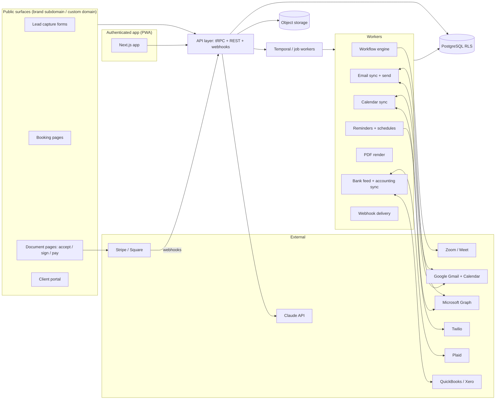

# Architecture and technology plan

## 1. Guiding constraints
- Small team, fast iteration, one codebase for web + mobile (PWA) initially.
- Multi-tenant SaaS with brand-level isolation and a public client-facing surface (portal, documents, booking pages, lead forms) on custom subdomains.
- Heavy background work: workflow scheduling, email sync, reminders, calendar sync, bank feeds, PDF generation, webhooks.
- Payments and e-signature must be auditable.

## 2. Recommended stack

| Layer | Choice | Why |
|---|---|---|
| Web app | **Next.js (App Router) + TypeScript + React** | SSR for client-facing pages, one framework for app + public pages; PWA support |
| UI | Tailwind + shadcn/ui, TanStack Table/Query, dnd-kit for Kanban | Fast, modern, accessible |
| Rich text | Tiptap (ProseMirror) with custom token node | Tokens as inline atoms; JSON storage; HTML/PDF render |
| API | tRPC (internal) + REST/OpenAPI (public) + webhooks | Type-safe internally, documented externally |
| DB | **PostgreSQL** (row-level security by brand_id), Prisma or Drizzle | Relational model in `04-data-model.md` |
| Search | Postgres full-text first; Meilisearch later | Global search / command palette |
| Jobs | **Temporal** (preferred) or BullMQ + Redis | Workflow runs are long-lived, timed, resumable, need retries and visibility |
| Storage | S3-compatible (files, PDFs, signatures) with signed URLs | |
| Email out | Postmark or SES (transactional) + user OAuth send via Gmail/Graph | Deliverability + "from your own address" |
| Email in | Gmail API push (Pub/Sub) and Microsoft Graph change notifications; IMAP fallback worker | Real-time vs 17hats' 30-min polling |
| Calendar | Google Calendar API (watch channels), Microsoft Graph, iCal feed generation, CalDAV later | |
| Payments | Stripe (Connect Standard) first; Square; PayPal later | Cards, ACH, Apple/Google Pay, saved cards, tips |
| Bank feeds | Plaid | Same as 17hats Bank Connect |
| Accounting sync | QuickBooks Online API, Xero API | Two-way with idempotency keys |
| Video | Zoom + Google Meet APIs | Booking links |
| SMS | Twilio | Two-way texting, reminders |
| PDF | Headless Chromium (Playwright) rendering the same React document view | One renderer for screen and PDF |
| AI | Claude API (Messages) with brand-scoped context; MCP server later | Drafting, summarising, extraction |
| Auth | Auth.js or Clerk; 2FA (TOTP); magic links for clients | |
| Infra | Vercel or Fly.io for web; managed Postgres (Neon/RDS); Redis; Temporal Cloud | |
| Observability | OpenTelemetry, Sentry, structured logs, status page | Support SLA |

## 3. System diagram

## 4. Key design decisions

1. **Workflow engine as durable workflows.** Each `workflow_run` is a Temporal workflow: steps are activities, timers implement "N days before base date", signals implement approvals, tag changes, document events, pause/resume. This gives retries, history, and the branching that 17hats lacks. If Temporal is too heavy for the team, BullMQ delayed jobs + a state machine table is the fallback; keep the engine behind an interface.
2. **Documents render once.** The client-facing document is a React page; the PDF is the same page rendered headlessly. Tokens resolve server-side at send time and are frozen into the document body (so later contact edits don't change a signed contract).
3. **Event-sourced document status.** `document_event` rows are the source of truth; status and totals are projections recomputed on each event. Same events feed workflow completion rules, Recent Activity, webhooks, Zapier.
4. **Brand-scoped RLS.** Every query sets `app.brand_id`; public pages resolve brand from host header. Linked brands share an account and user list but not data.
5. **Email identity.** Send through the user's connected mailbox when available (best deliverability and threads appear in their Sent folder), fall back to platform relay with per-brand verified sender. All inbound mail is matched by thread id, then by sender; unknown senders are queued as "unlinked" suggestions rather than dropped.
6. **Idempotent integrations.** Every push to Stripe/QBO/Xero/Google carries an idempotency key derived from our entity id + version to avoid the duplicate-payment class of bugs.
7. **17hats compatibility layer.** Token syntax parser, CSV importer, and workflow-template import so switchers keep their setup.

## 5. Security and compliance
- Stripe Elements / Square SDK for card entry; no PAN storage. ACH via Stripe Financial Connections.
- E-signature: capture drawn/typed signature image, signer email verification, IP, UA, timestamps, document hash; embed audit certificate in PDF (ESIGN/UETA).
- Encrypt integration credentials with KMS; rotate; least-privilege OAuth scopes.
- Audit log on documents, payments, permissions, exports.
- Per-brand data export and deletion jobs (portability requirement).

## 6. Environments and delivery
- Monorepo (pnpm workspaces): `apps/web`, `apps/workers`, `packages/db`, `packages/domain` (pure business rules: totals, status projection, token resolution, workflow scheduling), `packages/ui`, `packages/email-templates`.
- CI: typecheck, lint, unit tests on `packages/domain`, Playwright e2e for the client document flow, preview deploys per PR.
- Feature flags for phased rollout; public changelog generated from release notes.
