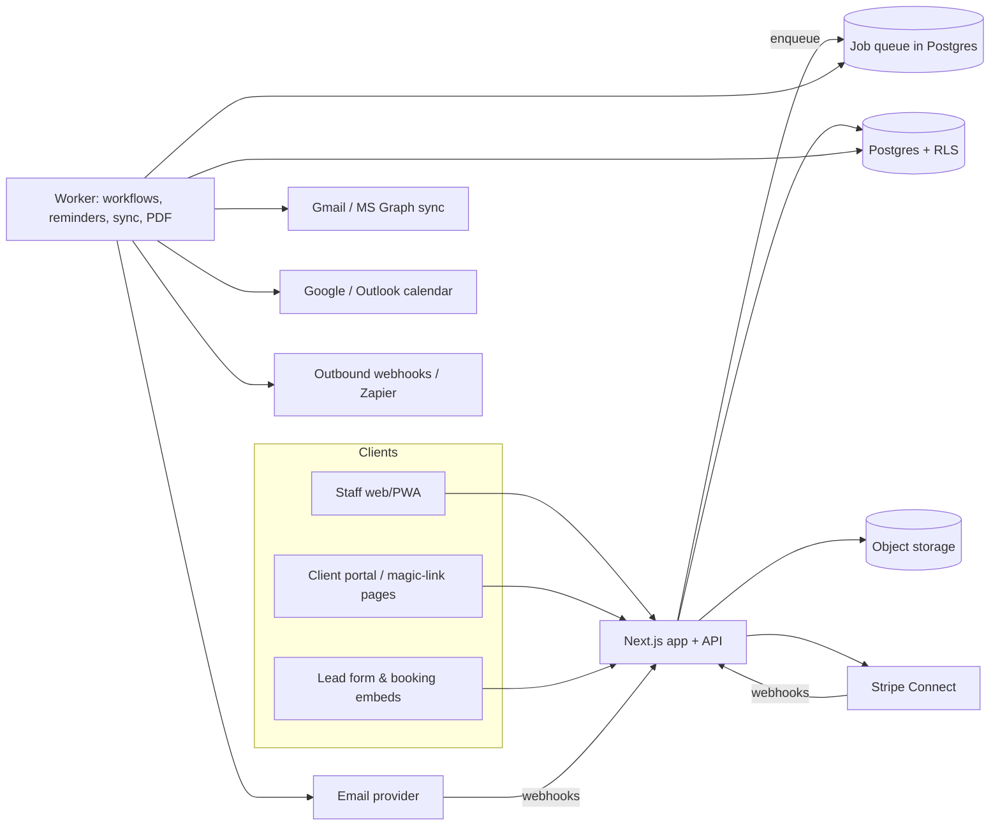

# Architecture Proposal

Working name for the clone: **"Hatless"** (placeholder — rename freely).
Goal: parity with 17hats' core loop (lead → quote → contract → invoice → project
→ automation) with the improvements listed in `02-improvements-backlog.md`,
built so a very small team can ship and operate it.

## 1. Guiding constraints

| Constraint | Decision |
|---|---|
| Small team, fast iteration | One TypeScript monorepo; one deployable web app + one worker. No microservices. |
| Money and signatures involved | Postgres as the single source of truth; append-only audit tables for documents, signatures, payments. |
| Automations are the product | A first-class **job scheduler + event bus** from day one, not bolted on. |
| Clients must never need an account | Signed, expiring **magic links** for every client-facing page. |
| Multi-tenant SaaS | Every table carries `account_id`; Postgres Row-Level Security enforces it. |
| Email is a core channel | Transactional sending via a provider (Postmark/Resend/SES) + OAuth mailbox sync (Gmail, Microsoft 365). |

## 2. Stack

- **Frontend:** Next.js (App Router) + React + TypeScript, Tailwind, shadcn/ui, TanStack Query/Table, react-hook-form + zod. Mobile-first responsive layout so the "mobile app" is a PWA in phase 1.
- **API:** tRPC (or REST via Hono) inside the same Next.js deployment; zod schemas shared with the UI.
- **DB:** PostgreSQL 16 (Neon/Supabase/RDS), Drizzle ORM, RLS policies per tenant.
- **Background jobs:** Postgres-backed queue (Graphile Worker or pg-boss) — workflows, reminders, email sync, PDF generation, webhooks. Cron-style "tick" job every minute evaluates due workflow steps.
- **Files:** S3-compatible object storage (R2/S3) with signed URLs; virus scan on upload.
- **PDF:** headless Chromium (Playwright) rendering the same React document view → PDF; stored immutably once signed/paid.
- **E-signature:** in-house — signature image/typed name + hashed document snapshot + IP/UA/timestamp + emailed certificate. (ESIGN/UETA-style audit trail; legal review before launch.)
- **Payments:** Stripe (Payment Intents, Payment Links optional, Connect Standard accounts per tenant, ACH, Apple/Google Pay, cards on file). Square/PayPal as later adapters behind a `PaymentProvider` interface.
- **Email:** outbound via Postmark/Resend with per-tenant sending domains (DKIM/SPF setup UI); inbound/sync via Gmail API and Microsoft Graph OAuth; webhooks for opens/clicks/bounces.
- **Calendar:** Google Calendar API + Microsoft Graph two-way sync; ICS feed per user.
- **Auth:** Auth.js/Clerk for staff (email+password, Google, passkeys, TOTP 2FA); magic links for clients.
- **Observability:** OpenTelemetry → Sentry + Grafana/Logs; per-tenant audit log table.
- **Infra:** Vercel or Fly.io for app + worker, managed Postgres, Cloudflare in front. IaC via Terraform when past MVP.

## 3. System diagram

## 4. Domain model (high level)

See `04-data-model.md` for the table-level schema. Core aggregates:

- **Account** (tenant) → Users, Brand, Settings, Subscription
- **Contact** (person) ↔ **Company**; tags; custom fields
- **Project** (job) → Contacts (roles), Status, Type, Dates, Tags, Notes, To-Dos, Files, Timeline
- **Document** (polymorphic: quote | contract | invoice | questionnaire) → Versions, Line items, Signatures, Payments, Views
- **Product/Service** catalog → Line-item templates, Packages, Add-ons
- **Workflow** (template) → Steps; **WorkflowRun** (instance on a project) → StepRuns
- **Event** (calendar) ↔ Project; **BookingService** → **Booking**
- **Email** (thread/message) ↔ Contact/Project; **EmailTemplate**
- **Payment**, **Refund**, **PaymentSchedule**; **Transaction** (bookkeeping), **Category**
- **Automation events** (append-only): `lead.created`, `quote.accepted`, `contract.signed`, `invoice.paid`, `questionnaire.completed`, `booking.created`, `project.status_changed`, `date.reached`

## 5. Workflow engine design (the differentiator)

- Every domain mutation emits an **event row** (outbox pattern) inside the same DB transaction.
- The worker consumes events and evaluates **triggers** on active `WorkflowRun`s and account-level **Rules** (event → start workflow).
- Steps are stored as a DAG (not just a list) so branching is possible: each step has `condition` (JSONLogic against project/contact/document context), `delay` (relative to previous step, project date, or fixed), and `approval` (auto | require approval).
- Step execution is idempotent (`step_run.id` as idempotency key for emails/documents).
- **Dry-run / preview**: simulate a workflow against a project and show the timeline before applying.
- **Versioning**: editing a template creates a new version; running instances pin the version they started with and can be upgraded explicitly.
- **Observability**: per-run log with "why did this fire / why is this waiting".

## 6. Client-facing surfaces

- `/c/:token` routes for quote acceptance, contract signing, invoice payment, questionnaire, booking, and a combined **portal** view listing everything for that contact.
- Tokens are JWT-like, scoped to one contact and optional document, revocable, with expiry and rotation.
- Fully mobile-responsive; PDF download of any document; branded per account (logo, colors, custom domain via CNAME in later phase).

## 7. Non-functional requirements

- p95 page load < 1.5s on the dashboard for accounts with 10k contacts.
- Workflow step latency: due steps execute within 60s of due time.
- Backups: PITR on Postgres; document PDFs immutable and versioned in object storage.
- Security: RLS, per-tenant encryption of OAuth tokens (KMS), 2FA, session management, rate limiting on public endpoints, CSRF on client pages, signed webhooks.
- Compliance: PCI SAQ-A (Stripe-hosted card entry), GDPR data export/delete, e-sign audit trail, email consent capture on lead forms.
- Data portability: full CSV/JSON export + PDFs zip from Settings on every plan (a deliberate improvement over incumbents).
